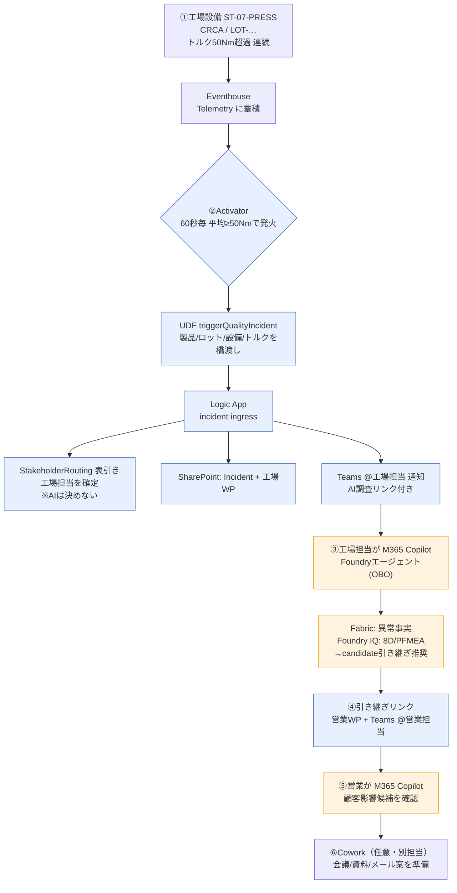

# 製造品質インシデント調査デモ（Fabric × Dynamics ERP × Foundry）

Microsoft Fabric のリアルタイム製造テレメトリと Dynamics 365 由来の受注・返品（ERP）データを統合し、
Microsoft Foundry のエージェントが工場・営業に**出典付きの判断材料**を返す、エンドツーエンドのデモ実装です。

> 異常検知 → 担当者への自動通知 → AI 横断調査 → 人の判断 → 営業への引き継ぎ までを、
> Microsoft Fabric / Foundry / M365 Copilot / Teams / SharePoint / Logic Apps でつなぎます。
> **AI は調査と整理**を担い、**担当者の決定と業務引き継ぎは決定論的ワークフロー**が担当します。

## 全体フロー



- 青 = 決定論的ワークフロー（人/表で確定。AI は判断しない）
- 橙 = AI 調査（Fabric Data Agent と Foundry IQ を横断、出典付き）

## ディレクトリ構成

| ディレクトリ | 役割 |
|---|---|
| `scenario-c/` | Fabric RTI（Eventstream / Eventhouse / Lakehouse / Dashboard / Activator）。既存 Fabric 担当の成果物。 |
| `fabric-data-agent/` | Fabric Data Agent の設定・例示クエリ。 |
| `agent/` | Microsoft Agent Framework で実装する Hosted Agent と、M365/Teams 向け Prompt Agent の provision。 |
| `foundry-iq/` | 品質文書（8D / PFMEA / Control Plan / 検査手順 / 顧客品質協定）と Knowledge Base の provision。 |
| `routing/` | 正式担当者を決める決定論的ルーティング。 |
| `power-automate/` | 通知・工場判断・営業引き継ぎ・Work Package 作成。`logic-apps/` に Azure Logic Apps 実装。 |
| `cowork/` | 会議・資料・メール作成の業務手順スキル（人の承認前提）。 |
| `copilot-studio/` | 任意の Teams 入口。コア実装へ依存させない。 |
| `contracts/` | Fabric / Teams / Power Automate / Cowork 間の契約と JSON Schema。 |
| `tasks/` | Copilot CLI で 1 回に実装する変更単位。 |
| `docs/` | 設計・運用ドキュメント。 |

## 主要コンポーネント

- **Foundry エージェント**
  - Hosted Agent: Responses Protocol / ローカル fixture 用。
  - Prompt Agent（M365/Teams 本番入口）: Fabric Data Agent を On-Behalf-Of（サインインユーザー identity）で照会。
  - 内部モードは `factory` と `sales`。
- **Fabric Data Agent**: 製造テレメトリ・受注・返品を自然言語で照会（利用者本人の権限）。
- **Foundry IQ**: 品質文書を MCP Knowledge Base として接続（文書質問のときに使用）。
- **決定論ワークフロー（Logic Apps）**: HTTP 受信 → StakeholderRouting で担当者確定 → SharePoint に Incident / Work Package 作成 → Teams 通知。
- **Activator → UDF → Logic Apps**: Power Automate を使わない自動連携経路。
- **SharePoint リスト**: `MQ_StakeholderRouting` / `MQ_QualityIncidents` / `MQ_WorkPackages`。Work Package は Cowork の入力。

## デモの流れ

1. **異常発生**: 圧入工程でトルクが規格上限（50Nm）を連続超過し、Eventhouse の `Telemetry` に蓄積（デモでは `scenario-c/inject_anomaly_eventhouse.py` で固定ロットの異常を注入し Activator を発火）。
2. **自動検知・通知**: Activator が発火 → UDF → Logic App が担当者を表引きで確定 → SharePoint 記録 → Teams へ @メンション通知（通知に AI調査リンク・引き継ぎリンク・Cowork起動リンク＋入力例を同梱）。
3. **工場 AI 調査**: 通知リンクから M365 Copilot で異常を確認し、品質文書（8D 等）も照会。営業への candidate 引き継ぎ要否を判断材料として提示。
4. **引き継ぎ**: Teams の引き継ぎリンクから営業 Work Package を作成し、営業担当へ @メンション通知。
5. **営業 AI 調査**: M365 Copilot で当該製品の Contoso 関連進行中受注を「候補（candidate）」として確認。
6. **Cowork（任意・別担当）**: Work Package を起点に、封じ込め会議・資料・初報メール案を**人の承認前提**で準備（通知の Cowork リンク＋入力例から起動）。

詳細な手順・プロンプト例・公開フォーム値は [`docs/18-operator-handoff.md`](docs/18-operator-handoff.md) を参照。
図解と挙動変更まとめは [`docs/19-demo-flow-and-changes.md`](docs/19-demo-flow-and-changes.md)。

## セットアップと実行（要点）

前提: Python 3.13 と [`uv`](https://github.com/astral-sh/uv)。Azure / Fabric / M365 はサインイン済み（キーレス、Entra 認証）。

```powershell
# 1) ローカルテスト（外部接続なし）
cd agent
uv run pytest
uv run python scripts/export_schemas.py --check   # Pydantic ⇄ JSON Schema 同期確認

# 2) Hosted Agent をローカル起動してスモーク（デプロイしない）
uv run azd ai agent run --no-inspector
uv run azd ai agent invoke --local --new-session "あなたの役割を1文で。"

# 3) M365/Teams 用 Prompt Agent を provision（Fabric + 任意で Foundry IQ KB）
uv run --extra foundry python scripts/provision_prompt_agent.py --with-kb
```

**デモ前チェック**と再シード（`--keep-open` で異常を最新に保つ）、公開フォーム値、トラブルシュートは
[`docs/18-operator-handoff.md`](docs/18-operator-handoff.md) のチェックリストにまとめています。

## 安全境界（[AGENTS.md](AGENTS.md) 準拠）

- 原因仮説は常に **未検証（unverified）**。
- 製品番号だけ一致する受注は **候補（candidate）**。ロット引当を確認できない限り **確定（confirmed）にしない**。
- 正式担当者は AI に推測させず、**StakeholderRouting** から決定する。
- 設備停止・出荷停止・ERP 更新・メール送信を **エージェントから自動実行しない**（人の承認のうえ実施）。
- ツール失敗時に事実を捏造しない（`warnings` / `open_questions` を返す）。
- 利用者向けの回答は日本語。

## 注意

- 既存の `scenario-c/` デモを壊さない。
- 秘密情報（トークン・接続文字列・コールバック URL・実メールアドレス）はコミットしない。
  本リポジトリのデモ識別子は公開向けに無害化（`contoso-demo` / `example.com` 等のプレースホルダ）してある。
- Fabric 容量が小さい（F2 等）と連続クエリでスロットリングが出ることがある。デモ時は異常投入を 1 回に絞るか、上位 SKU へスケールする。

## 参考ドキュメント

- [`START_HERE.md`](START_HERE.md) — 実装開始ガイド
- [`AGENTS.md`](AGENTS.md) — 目的・絶対条件・アーキテクチャ判断・完了条件
- [`docs/18-operator-handoff.md`](docs/18-operator-handoff.md) — 運用ハンドオフ / デモ台本 / 公開フォーム値
- [`docs/19-demo-flow-and-changes.md`](docs/19-demo-flow-and-changes.md) — デモフロー図解と挙動変更まとめ
- [`docs/17-deployment-and-demo.md`](docs/17-deployment-and-demo.md) — デプロイ / デモ / teardown
- [`power-automate/logic-apps/README.md`](power-automate/logic-apps/README.md) — Logic Apps 実装と運用
