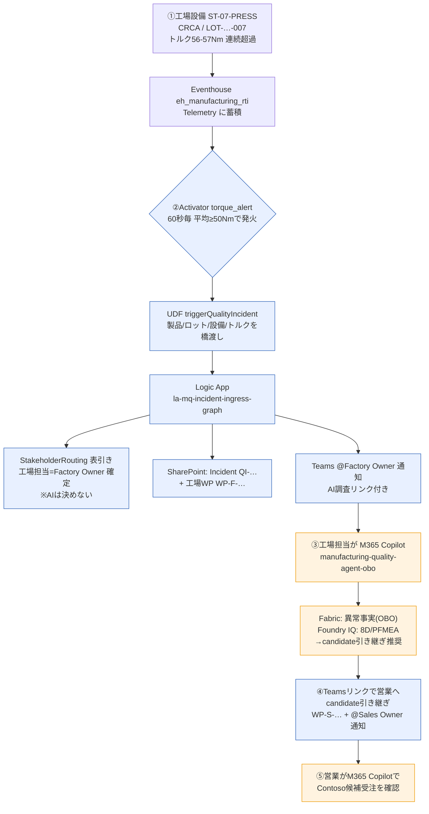

# デモフロー図解 & 挙動変更まとめ（チーム共有用）

異常検知 → 自動通知 → AI調査の end-to-end デモフローと、チームに未共有の挙動変更を1枚にまとめる。
2026-06-29 時点。実機で end-to-end 検証済み（メイン run: `QI-20260629-053859`）。

## 全体フロー



- 青 = 決定論ワークフロー（人/表で確定。AIは判断しない）
- 橙 = AI調査（Fabric + Foundry IQ を横断、出典付き）

## ステップ詳細

### ① 異常発生（Fabric RTI）
圧入機 `ST-07-PRESS` が `CRCA / LOT-CRCA-…-007` 加工中にトルク50Nm超過を連続記録。
Eventhouse `eh_manufacturing_rti` の `Telemetry` に蓄積。連続超過＝「異常継続中」の根拠。

### ② 自動検知→担当者通知（AIなし）
1. Activator `torque_alert` が60秒毎にEventhouseを集計、平均≥50Nmで発火。
2. UDF `triggerQualityIncident` が文脈を渡す。
3. Logic App `la-mq-incident-ingress-graph` が `StakeholderRouting` を表引きして担当者確定 → SharePointにIncident+WP作成 → Teamsで@メンション通知。

### ③ 工場AI調査（M365 Copilot, 1発コンボ）
```
今、製造ラインで品質異常は出ていますか？製品・ロット・ステーション・トルク超過を確認し、過去の8Dと初動対応を品質文書から示し、営業へcandidate引き継ぎが必要か推奨まで一度で教えて。
```
出力: 冒頭1行結論＋Fabric事実＋Foundry IQ(8D/PFMEA/CP/校正)＋candidate推奨。原因は未検証、自動実行なし。

### ④ candidate引き継ぎ → ⑤ 営業AI調査
Teams通知の引き継ぎリンクで sales WP作成＋@営業通知。営業は異常連動で Contoso 候補受注を確認（confirmed化しない）。

## チームに未共有の挙動変更（重要）

1. **Activatorの通知経路**: 旧=Teams直接1通 → 新=Activator → UDF → Logic Apps → SharePoint記録＋@メンション通知。
2. **担当者は表で確定**: `StakeholderRouting` ルックアップで決定論。AIに正式担当者を推測させない。
3. **Agentプロンプト v11**: 工場1発コンボ／営業は異常連動candidate／冒頭1行サマリ＋空セクション省略（安全注記は維持）。M365へはv11反映に再発行+admin承認+新規チャットが必要。

## 主要リソース

- Eventhouse: `eh_manufacturing_rti`、Activator: `factory_activator` / `torque_alert`(≥50Nm)
- UDF: `triggerQualityIncident`、Logic Apps: `la-mq-incident-ingress-graph` / `la-mq-factory-decision-handoff(-link)-graph`
- SharePoint: `MQ_QualityIncidents` / `MQ_WorkPackages` / `MQ_StakeholderRouting`
- 工場: factory.owner@example.com / 営業: sales.owner@example.com、通知: Operations Department / Manufacturing Quality Alerts
- Agent: `manufacturing-quality-agent-obo`（OBO, Fabric + Foundry IQ）

注: callback URL等の秘密値は本書に記載しない。詳細手順は docs/18 を参照。
