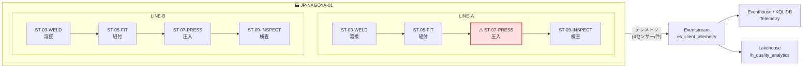

# シナリオC + RTI：リアルタイム品質異常 × ERP 複合分析

工場ライン IoT テレメトリをクライアント（ローカル Python）から Fabric RTI へリアルタイム送信し、
KQL で蓄積 → 異常検知 → ERP（OneLake ショートカット）と複合分析するデモ実装。

設計の詳細は [docs/design.md](docs/design.md) を参照。

## 前提
- Azure CLI ログイン済み（`az login`）。Fabric ワークスペースへの寄与者以上の権限。
- PowerShell 5.1 / Python 3.10+。

## 環境設定（初回のみ）
環境固有の値（ワークスペース ID 等）はリポジトリに含めていない。`config.example.json` をコピーして
`config.local.json`（`.gitignore` 済）を作成し、自分の値を設定する。

```powershell
cd scenario-c
Copy-Item config.example.json config.local.json
# config.local.json を編集して以下を設定:
#   workspaceId     : Fabric ワークスペース ID
#   erpLakehouseId  : ERP(Dataverse Link to Fabric) Lakehouse の itemId
#   alertRecipient  : Activator アラートの Teams 通知先
```

> 環境変数 `FABRIC_WORKSPACE_ID` / `FABRIC_ERP_LAKEHOUSE_ID` / `FABRIC_ALERT_RECIPIENT` でも指定可能（config より優先）。

> 🎬 **デモ当日の実演手順は [docs/DEMO.md](docs/DEMO.md) を参照。**

## ライン／ステーション構成

工場 `JP-NAGOYA-01` に 2 ライン（`LINE-A` / `LINE-B`）。各ラインは 4 ステーションを直列に通過し、
各ステーションが 4 センサー（振動 / 温度 / トルク / 寸法偏差）を出力する。異常は `ST-07-PRESS`（圧入）で発生させる。



| センサー | フィールド | 平常値（平均±σ） | しきい値 |
|---|---|---|---|
| トルク | `torque_nm` | 45.0 ± 1.5 | `fail` > 50 / `warn` > 48 |
| 振動 | `vibration_mm_s` | 3.5 ± 0.4 | `warn` > 4.6 |
| 温度 | `temperature_c` | 60.0 ± 2.5 | — |
| 寸法偏差 | `dimension_dev_um` | 8.0 ± 2.0 | `fail` > 15 |

> 異常フェーズでは `ST-07-PRESS` のトルクを主信号として悪化させ、振動 / 温度 / 寸法はトルクより控えめに上昇させる。

## 構築手順（番号順に実行）
```powershell
cd scenario-c
.\01_create_eventhouse.ps1        # Eventhouse + KQL DB → rti_info.json
.\02_create_telemetry_table.ps1   # Telemetry テーブル + ストリーミング取込 + JSON マッピング
.\03_create_eventstream.ps1       # Eventstream + カスタムEP → .eventstream_connection.json (秘匿)
.\04_create_erp_shortcuts.ps1     # ERP 3テーブルへ OneLake ショートカット + external table 登録
.\06_create_dashboard.ps1         # Real-Time Dashboard 作成
.\07_create_lakehouse_analysis.ps1 # 分析用 Lakehouse + ERP ショートカット(レイクハウス側分析用)
.\09_add_lakehouse_destination.ps1 # Eventstream に Lakehouse 宛先を追加(Telemetry を約1分で Delta 直送)
.\11_create_activator.ps1         # Activator(Reflex) の空シェル作成 + アラート設定の UI 手順案内
```

> `10_duplicate_dashboard.ps1` は既存ダッシュボードを複製したい場合のオプション。

> `08` で Telemetry を使う場合は `09` を実行しておくこと。Eventstream から `lh_quality_analytics` に Telemetry(Delta)
> を**直接書き込む**ため、`--mode eventstream` で送ると Eventhouse と Lakehouse の**両方に約1分で到達**する。

## リアルタイム送信（クライアント側）
```powershell
python -m venv .venv
.\.venv\Scripts\pip install -r requirements.txt

# 単発: 平常15秒 → CRCA 異常30秒（10件/秒）
.\.venv\Scripts\python telemetry_sender.py --mode eventstream --rate 10 `
    --normal-seconds 15 --anomaly-seconds 30 --recovery-seconds 0 --anomaly-product CRCA

# 連続デモ（平常→異常→回復をループ）
.\.venv\Scripts\python telemetry_sender.py --mode eventstream --loop --anomaly-product CRCA

# 平常運転のみ
.\.venv\Scripts\python telemetry_sender.py --mode eventstream --normal-only
```

### 主なオプション
| オプション | 既定 | 説明 |
|---|---|---|
| `--mode` | `eventstream` | `eventstream`（推奨）/ `kusto`（直接取込） |
| `--rate` | 10 | 1秒あたり送信件数 |
| `--normal-seconds` | 30 | 平常フェーズ秒数 |
| `--anomaly-seconds` | 30 | 異常フェーズ秒数 |
| `--recovery-seconds` | 20 | 回復フェーズ秒数 |
| `--anomaly-product` | `CRCA` | 異常を注入する製品コード |
| `--loop` | off | フェーズを無限ループ |
| `--normal-only` | off | 平常運転のみ送信 |

## 複合分析の実行

複合分析は **2つの実行先**から選べる。

### A) Eventhouse 側（KQL・即時）
```powershell
.\05_run_analysis.ps1     # 異常検知 + ERP 複合分析クエリを KQL で一括実行
```
クエリ単体は [queries/analysis.kql](queries/analysis.kql) を参照（KQL Queryset に貼り付け可）。
ERP は KQL DB 内の `external_table()` ショートカット経由。**取込から数秒で反映**＝デモのリアルタイム性向け。

### B) レイクハウス側（SQL エンドポイント・T-SQL）
```powershell
.\08_run_lakehouse_analysis.ps1   # 分析用 Lakehouse の SQL エンドポイントで T-SQL 結合を一括実行
```
クエリ単体は [queries/lakehouse_analysis.sql](queries/lakehouse_analysis.sql) を参照（SQL エンドポイントに貼り付け可）。
`lh_quality_analytics` に Telemetry(Eventstream 直送の Delta)＋ERP(ショートカット)を置き、T-SQL で結合。

> **鮮度**: `09` により Telemetry は Eventstream から Lakehouse に直接書き込まれるため、**送信から約1分**で現れる（旧方式の Eventhouse→OneLake ミラーの数十分遅延は不要）。
> ただし `--mode kusto` は Eventhouse 直送で Lakehouse には届かないため、B) を見せるなら `--mode eventstream` で送ること。
> 小さな Delta ファイルが増えるため、必要に応じて `OPTIMIZE` を実行。

## 注意
- `config.local.json` は環境固有の設定（**コミット禁止**）。`.gitignore` 済。公開用は `config.example.json`（プレースホルダ）のみ。
- `.eventstream_connection.json` は接続文字列（**秘匿情報**）。`.gitignore` 済。コミット・共有しないこと。
- `rti_info.json` / `dashboard_info.json` / `lakehouse_info.json` / `activator_info.json` はスクリプト実行時に生成される環境固有ファイル（Fabric リソース ID / クラスタ URI を含む）。`.gitignore` 済で、`01` 以降を順に実行すれば再生成される。
- Eventstream 経由の取込は約1分の遅延あり。即時確認したい場合は `--mode kusto`。
- `lakehouse_info.json` は SQL エンドポイント接続情報。`08` 実行時に参照。

## アラート（Activator / Teams 通知）
センサー異常（例: トルク 50Nm 超）を Teams へ通知する。
- Real-Time Dashboard のセンサー 4 タイル（トルク/振動/温度/寸法）は時間範囲パラメーター（`_startTime`/`_endTime`）を使うため、タイルから「アラートの設定」が可能。
- `11_create_activator.ps1` は Activator の空シェルを作成し、ルール設定の UI 手順を案内する（本キャパシティでは Reflex の定義を API でインポートできないため、ルールはポータル UI で設定）。
- トルクアラートの推奨設定: 監視フィールド `トルク平均(Nm)` / グループ化 `station_id` / 条件 `>= 50`。
